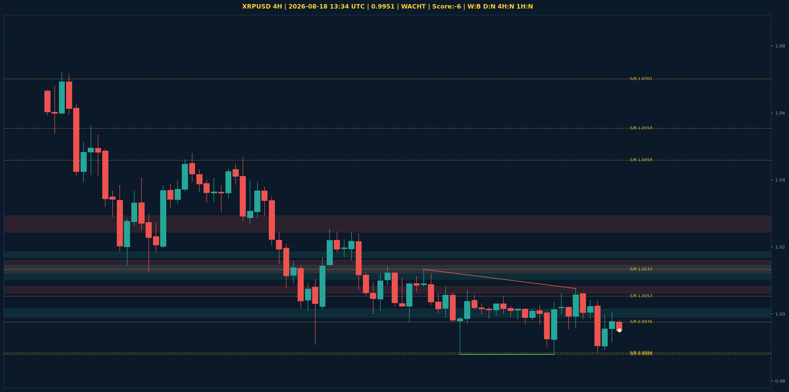

# XRPUSD Liquidity Sweep Analyse - 2026-08-18 13:34 UTC

> Prijs: 0.9951 | Beslissing: WACHT | Score: -6

---

## Liquidity Sweep

- **Manipulatie:** BEARISH @ 0.9969
- **5m reversal (BOS/iFVG):** bevestigd (iFVG: BEARISH)
- **1m entry trigger:** bevestigd
- **BTC 5m trend:** BULLISH | **Correlatie:** niet aligned
- **Draws on liquidity (highs):** [0.9969, 1.0005, 1.0039, 1.0076]
- **Draws on liquidity (lows):** [0.988, 0.9884, 0.9915, 0.995]

---

## Grafiek

---

## Top-Down Trend

| TF | Trend |
|---|---|
| Weekly | BEARISH |
| Daily | NEUTRAAL |
| 4H | NEUTRAAL |
| 1H | NEUTRAAL |
| 30min | BULLISH |
| 5min | NEUTRAAL |

## Fibonacci (swing 0.9884 - 1.3838)

| Level | Prijs |
|---|---|
| 23.6% | 1.2905 |
| 38.2% | 1.2327 |
| 50.0% | 1.1861 |
| 61.8% | 1.1394 |
| 78.6% | 1.0730 |

## S/R

Daily: [0.9884, 1.0459, 1.0554, 1.0701, 1.1275, 1.1628, 1.1812, 1.2893]
4H: [0.988, 0.9976, 1.0053, 1.0133]
1H: [0.9884, 0.9915, 0.9955, 0.9985, 1.0039, 1.0076]

*MVR Trading Agent | 2026-08-18 13:34 UTC*
